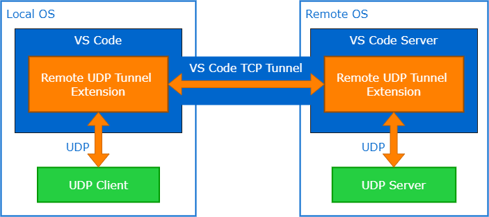

# Remote UDP Tunnel

Provides "Forward a Port" for UDP ports when using [VS Code Remote Development](https://code.visualstudio.com/docs/remote/remote-overview)

## Features

`Remote UDP Tunnel: Forward a Port` command exposes a UDP port on the local machine which proxies traffic to the selected port in the remote workspace.

The UDP traffic is tunneled via vscode's builtin TCP port forwarding.

When you're done using the port, close it with the `Remote UDP Tunnel: Stop Forwarding Port` via the command palette or via the "UDP" explorer view added by the extension.

Why yes, that _is_ Factorio connected to a server over the UDP tunnel.

## Alternatives

If you know the UDP port number you will need access to in advance, and you can configure the remote environment (eg. the devcontainer) to make that port available,
then it is likely simpler and more robust for you to use [a method such as this](https://stackoverflow.com/questions/69002661/how-to-forward-a-udp-port-from-a-devcontainer).

If, as I did, you find yourself working with UDP servers on ephemeral / dynamic ports or have other reasons to rely on access over VS Code's builtin TCP tunnel, then this extension may help you.

## Limitations

- Because the UDP traffic is tunneled over TCP, this will introduce [Head-of-line blocking](https://en.wikipedia.org/wiki/Head-of-line_blocking) and generally alter some UDP traffic characteristics.
- The encoding and decoding of UDP over TCP adds 2 bytes of overhead per datagram and so this may reduce the effective MTU by 2 bytes.
- The proxy decoder has a small chance of fragmenting some UDP packets. I have not observed this in practice so far.
- The "Time to First Byte" for a new client sending packets can be over a second as the VS Code TCP tunnel itself has a very slow handshake to complete on each new connection.
- The extension does not currently auto-detect open UDP ports and forward them, as the TCP version built in to vscode does. I may add this feature.
- This extension won't work with vscode running in browser-sandboxed scenarios (such as codespaces) where the extension cannot open a UDP port for you to access.

## Extension Settings

This extension exposes no settings.

## Release Notes

### 0.0.1

Alpha release. Good Luck, Have Fun!
